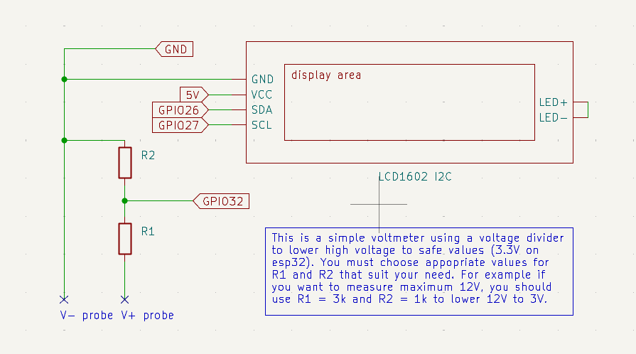

# voltmeter
using a voltage divider and a LCD1602 with a PCF8574T I2C to I/O module to make a somewhat accurate voltmeter. this thing does not depend on any special ability of the esp32 so you can use this with any MCU as long as it has an ADC.
## schematic

## usage
just connect the probes to a power source and see the result
