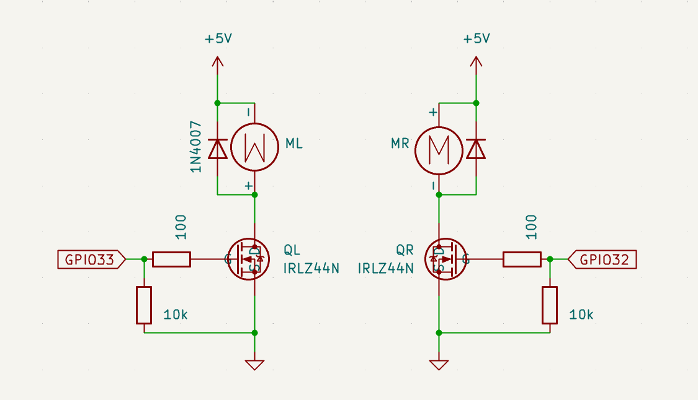

# wifi motors
control 2 motors over WiFi
## schematic

## usage
1. connect your phone to the esp32 network
2. use a serial wifi app (like [Serial WiFi Terminal by Kai Morich](https://play.google.com/store/apps/details?id=de.kai_morich.serial_wifi_terminal&hl=en)) and connect to the esp32
3. send 'f', 'l', 'r' to control the motors
