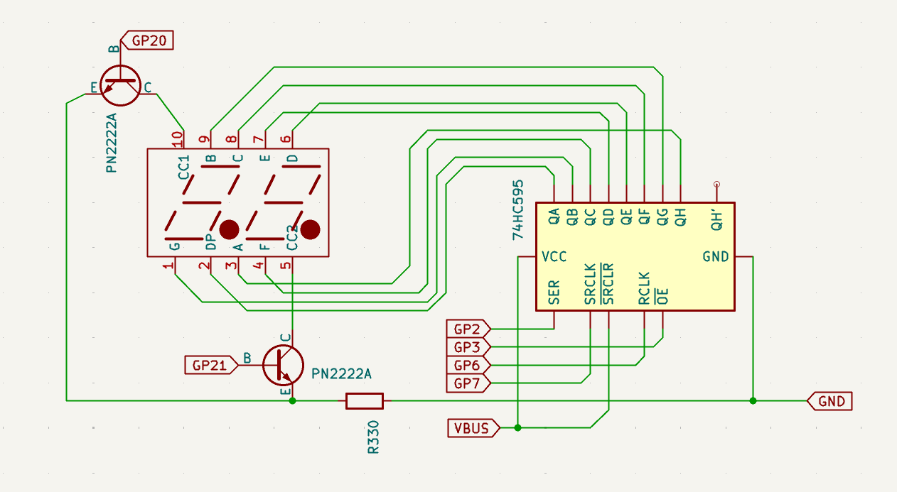

# segment display
driving a 2 digits segment display using 74HC595
## schematic

## usage
the display shares the same segment pins for both digits, so we need to keep switching on and off from this digit to that digit, creating the illusion that both digits are on at the same time. take a picture with a small enough exposure, you will see that at any given moment, only one digit is on. for multiple displays of this type, i would have a dedicated 74HC595 chain to drive the BJTs instead of wiring them to the MCU, that way the system could be scaled up easily
